# 🌊 Documentación de Flujos de la API (TypeScript)

Este documento detalla el viaje interno de los datos en cada petición, explicando cómo interactúan las capas de seguridad, validación y lógica de negocio en nuestra arquitectura TypeScript.

## 📑 Índice

1.  [Crear Usuario (POST /usuarios)](#1-crear-usuario-post-usuarios)
2.  [Login de Usuario (POST /usuarios/login)](#2-login-de-usuario-post-usuarioslogin)
3.  [Obtener Usuario (GET /usuarios/:username)](#3-obtener-usuario-get-usuariosusername)
4.  [Listar Usuarios (GET /usuarios)](#4-listar-usuarios-get-usuarios)
5.  [Actualizar Usuario (PUT /usuarios/:username)](#5-actualizar-usuario-put-usuariosusername)
6.  [Eliminar Usuario (DELETE /usuarios/:username)](#6-eliminar-usuario-delete-usuariosusername)
7.  [Crear Juego (POST /juegos)](#7-crear-juego-post-juegos)
8.  [Listar Juegos (GET /juegos)](#8-listar-juegos-get-juegos)
9.  [Obtener Juego (GET /juegos/:titulo)](#9-obtener-juego-get-juegostitulo)
10. [Actualizar Juego (PUT /juegos/:titulo)](#10-actualizar-juego-put-juegostitulo)
11. [Eliminar Juego (DELETE /juegos/:titulo)](#11-eliminar-juego-delete-juegostitulo)

---

## 1. Crear Usuario (`POST /usuarios`)

Este flujo convierte a un visitante anónimo en un usuario registrado. Incluye validación de datos y encriptación de seguridad.

### 👣 Paso a Paso

1.  **Petición:** El cliente envía un JSON con `username`, `password`, `email`, etc.
2.  **Router (`src/routes/user.routes.ts`):** Recibe la petición en `POST /`.
3.  **Middleware de Validación (`validateUser`):**
    *   Intercepta los datos **antes** del controlador.
    *   Verifica: ¿Tiene email? ¿Password > 6 caracteres? ¿Username no vacío?
    *   🔴 **Si falla:** Devuelve `400 Bad Request` con la lista de errores.
    *   🟢 **Si pasa:** Llama a `next()`.
4.  **Controlador (`createUserController` en `src/controllers/user.controller.ts`):**
    *   Recibe los datos limpios y tipados (Request).
    *   Llama al servicio.
5.  **Servicio (`createUser` en `src/services/user.service.ts`):**
    *   🔐 **Encriptación:** Usa `bcrypt.hash(password, 10)` para convertir "123" en `$2a$10$Kj8...`.
    *   Sustituye la contraseña plana por el hash.
    *   Llama a Mongoose.
6.  **Base de Datos (MongoDB):** Guarda el documento con la contraseña ya encriptada.

### 🧭 Diagrama

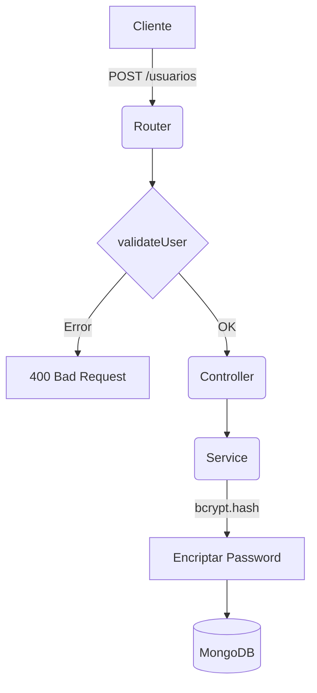

---

## 2. Login de Usuario (`POST /usuarios/login`)

Este flujo verifica la identidad del usuario y le entrega una "llave" (Token) para acceder al sistema.

### 👣 Paso a Paso

1.  **Petición:** El cliente envía `username` y `password` (texto plano).
2.  **Router:** Recibe en `POST /login`.
3.  **Controlador (`loginController`):**
    *   Llama al servicio `loginUser`.
4.  **Servicio (`loginUser`):**
    *   Busca al usuario por `username` en la BD.
    *   🔍 **Verificación:** Usa `bcrypt.compare(passwordPlano, passwordHash)` para ver si coinciden.
    *   Devuelve el usuario si es correcto, o `null` si no.
5.  **Controlador (Vuelta):**
    *   🔴 **Si es null:** Devuelve `401 Credenciales inválidas`.
    *   🟢 **Si es correcto:** Genera un **JWT (JSON Web Token)**.
        *   Firma el token con `process.env.JWT_SECRET`.
        *   Incluye el `_id` y `username` dentro del token.
        *   Establece caducidad (ej: 2 horas).
    *   Devuelve el Token al cliente.

### 🧭 Diagrama

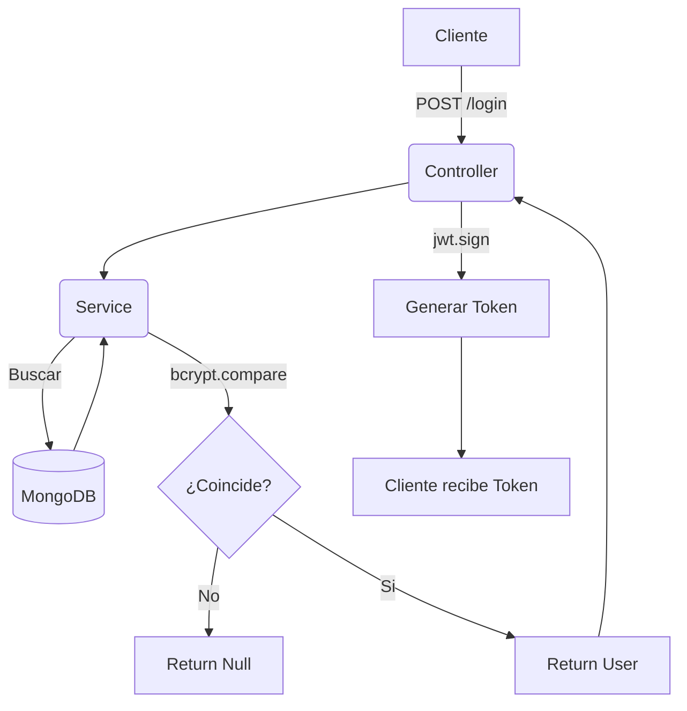

---

## 3. Obtener Usuario (`GET /usuarios/:username`)

Este es un ejemplo de una **Ruta Protegida**. Solo se puede acceder con un Token válido.

### 👣 Paso a Paso

1.  **Petición:** El cliente envía la petición con la cabecera `Authorization: Bearer <TOKEN>`.
2.  **Router:** Detecta el middleware `auth`.
3.  **Middleware de Autenticación (`auth` en `src/middleware/auth.middleware.ts`):**
    *   Extrae el token de la cabecera.
    *   🕵️ **Verificación:** Usa `jwt.verify(token, secret)` para comprobar que el token es auténtico y no ha caducado.
    *   🔴 **Si falla:** Devuelve `401 Unauthorized`.
    *   🟢 **Si pasa:** Añade `req.user` con los datos del token y llama a `next()`.
4.  **Controlador (`getUserByUsernameController`):**
    *   Se ejecuta sabiendo que el usuario es legítimo.
    *   Busca la información y la devuelve.

### 🧭 Diagrama

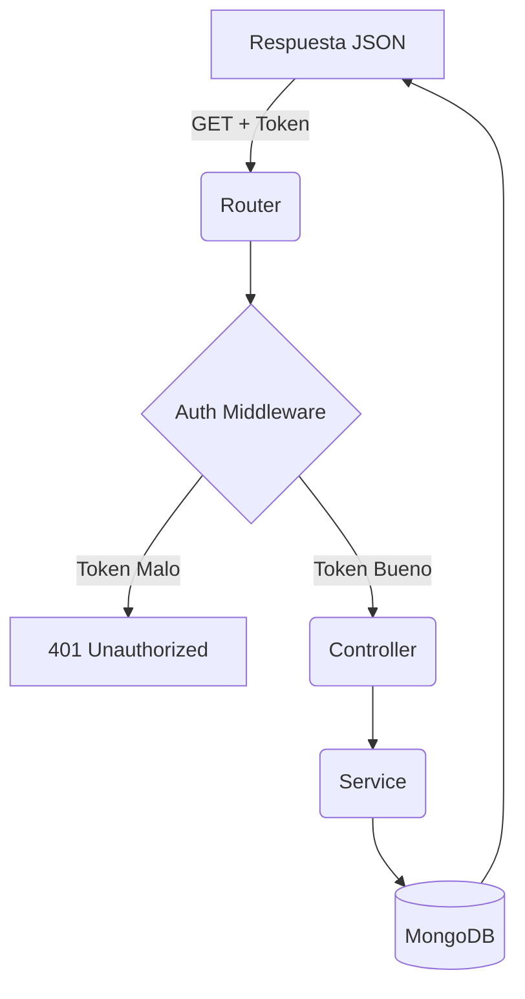

---

## 4. Listar Usuarios (`GET /usuarios`)

*   **Seguridad:** Requiere Token (`auth`).
*   **Acción:** Devuelve un array con todos los usuarios.

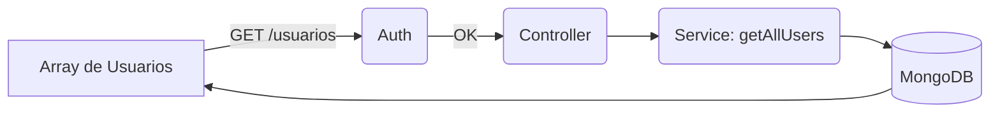

---

## 5. Actualizar Usuario (`PUT /usuarios/:username`)

*   **Seguridad:** Requiere Token (`auth`).
*   **Funcionalidad Extra:** Soporta subida de archivos (`multipart/form-data`) para la foto de perfil.
*   **Acción:** Busca por username y actualiza los campos enviados (incluyendo la ruta de la imagen si se sube).

### 👣 Paso a Paso

1. **Petición:** El cliente envía datos (texto) y/o archivo (`profilePicture`) en formato `multipart/form-data`.

2.  **Router:**
    *   Verifica Token (`auth`).
    *   **Middleware de Archivos (`upload.single('profilePicture')`):**
        *   Procesa la imagen entrante.
        *   La guarda en la carpeta `uploads/`.
        *   Añade `req.file` a la petición con los datos del archivo guardado.
3.  **Controlador (`updateUserByUsernameController`):**
    *   Recibe `req.body` (datos texto) y `req.file` (archivo).
    *   Si hay archivo, añade la ruta (`req.file.path`) al objeto de actualización.
    *   Llama al servicio.
4.  **Servicio (`updateUserByUsername`):**
    *   Actualiza el documento en Mongo.

### 🧭 Diagrama

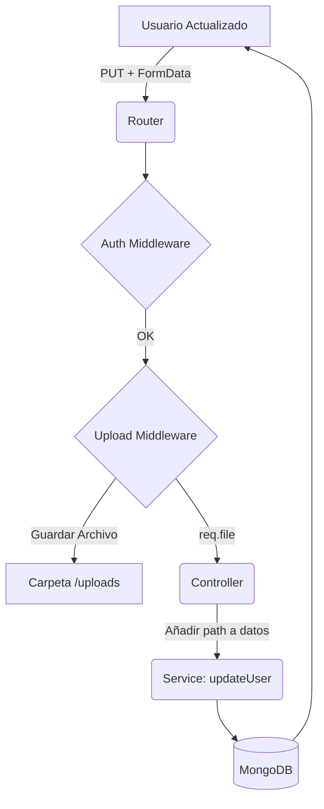

---

## 6. Eliminar Usuario (`DELETE /usuarios/:username`)

*   **Seguridad:** Requiere Token (`auth`).
*   **Acción:** Borra permanentemente al usuario.

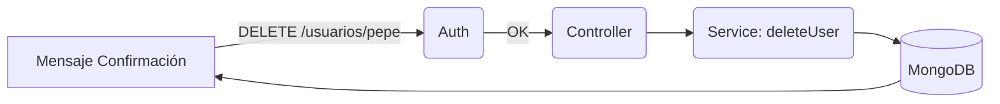

---

# 🎮 Flujos de Juegos

## 7. Crear Juego (`POST /juegos`)

Este flujo es especial porque tiene **Doble Protección**: Autenticación + Validación.

### 👣 Paso a Paso

1.  **Auth:** ¿Tienes Token? (Si no -> 401).
2.  **Validación (`validateGame`):** ¿El título existe? ¿Puntuación 0-100? (Si no -> 400).
3.  **Controlador:** Recibe datos seguros.
4.  **Servicio:** Crea el juego.

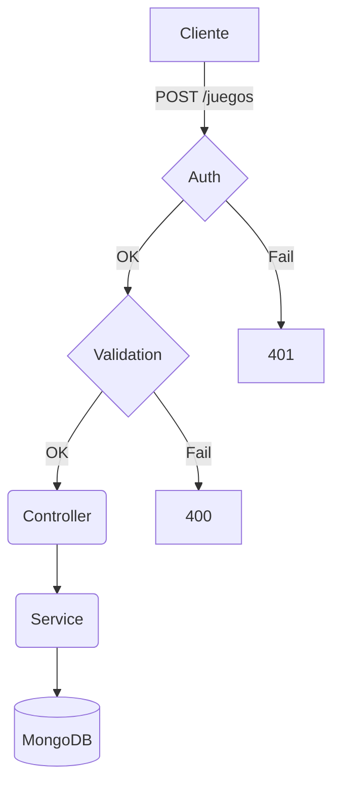

---

## 8. Listar Juegos (`GET /juegos`)

*   **Seguridad:** Requiere Token (`auth`).

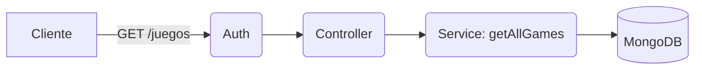

## 9. Obtener Juego (`GET /juegos/:titulo`)

*   **Seguridad:** Requiere Token (`auth`).

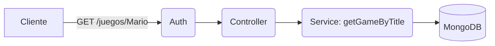

## 10. Actualizar Juego (`PUT /juegos/:titulo`)

*   **Seguridad:** Requiere Token (`auth`).
*   **Validación:** Pasa por `validateGame` para asegurar que los nuevos datos son correctos.

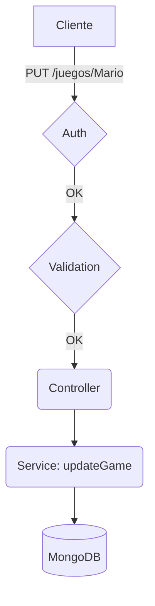

## 11. Eliminar Juego (`DELETE /juegos/:titulo`)

*   **Seguridad:** Requiere Token (`auth`).

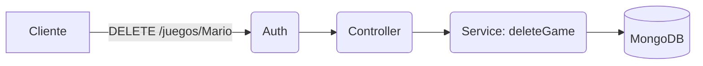
